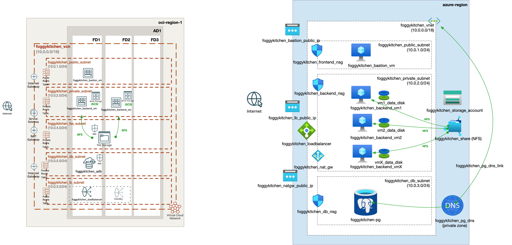

# FoggyKitchen Multicloud Course – OCI & Azure Edition 🌩️☁️

Welcome to the **FoggyKitchen Multicloud Infrastructure Course**, where we explore and compare **Oracle Cloud Infrastructure (OCI)** and **Microsoft Azure** side-by-side using **Terraform/OpenTofu**.

You will build hands-on projects and gain real-world experience designing foundational cloud infrastructure components across both platforms.

---

## 🚀 What You Will Learn

- ✅ How to design and provision **networking, compute, load balancers, and storage** in OCI & Azure
- ✅ How to write **modular Terraform code** that works across clouds
- ✅ How to deploy **resilient backend applications** with persistent block and shared file storage
- ✅ How to work with **databases in the cloud** using native services (PostgreSQL, Autonomous DB)
- ✅ How to implement **VNet/VCN peering** (local and cross-region)
- ✅ How to think **multicloud**, not just multi-provider

---

## 🧱 Course Structure

The course consists of **8 hands-on modules**, each implemented in **Azure and OCI**.

| Module | Description                                          |
|--------|------------------------------------------------------|
| [01 - Networking](module-01-networking/)         | Foundational VCN/VNet setup with public/private subnets |
| [02 - Compute](module-02-compute/)              | Bastion host + backend VMs in private subnets           |
| [03 - Load Balancer](module-03-loadbalancer/)   | Public Load Balancer setup and testing                  |
| [04 - Storage](module-04-storage/)              | Block storage & shared NFS across backend VMs           |
| [05 - Database](module-05-database/)            | PostgreSQL (Azure) and Autonomous DB (OCI) integration  |
| [06 - Local Peering](module-06-local-peering/)  | VCN/VNet peering in the same region                     |
| [07 - Cross-Region Peering](module-07-cross-region-peering/) | Multiregion DRG/VNet peering & secure DB access        |
| [08 - Advanced Routing](module-08-advanced-routing/) | Multicloud mesh-style and transitive routing across VCNs/VNets and regions        |

---

## 🗺️ Multicloud Topology

This high-level diagram shows how the core components of the FoggyKitchen multicloud setup align across Oracle Cloud Infrastructure (OCI) and Microsoft Azure.



---

## 📁 Repo Layout

```
foggykitchen_multicloud/
├── module-01-networking/
│   ├── oci/
│   └── azure/
├── module-02-compute/
│   ├── oci/
│   └── azure/
...
```

Each module has its own `README.md` with instructions to deploy the setup using `terraform` or `tofu`.

---

## ✅ Prerequisites

- Basic familiarity with **Terraform or OpenTofu**
- Access to both **OCI** and **Azure** (with required CLI tools installed)
- Terraform 1.6+ or OpenTofu 1.6+

---

## 📣 Why This Course?

Multicloud is not just a buzzword.  
This course is a **practical guide** for engineers who want to:

- Compare services across clouds
- Build vendor-neutral automation
- Prepare for hybrid/multicloud projects

---

## 🧹 Cleanup

Don’t forget to run:

```bash
tofu destroy
# or
terraform destroy
```

…to avoid unnecessary cloud costs after each module.

---

## 🌐 Learn More

📘 Tutorials, videos and diagrams: [FoggyKitchen.com](https://foggykitchen.com)  
🎥 YouTube demos coming soon!

---

## 🪪 License

Licensed under the Universal Permissive License (UPL), Version 1.0.  
See [LICENSE](./LICENSE) for details.