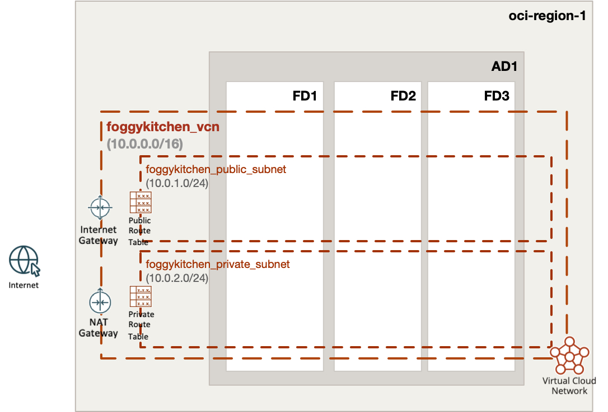
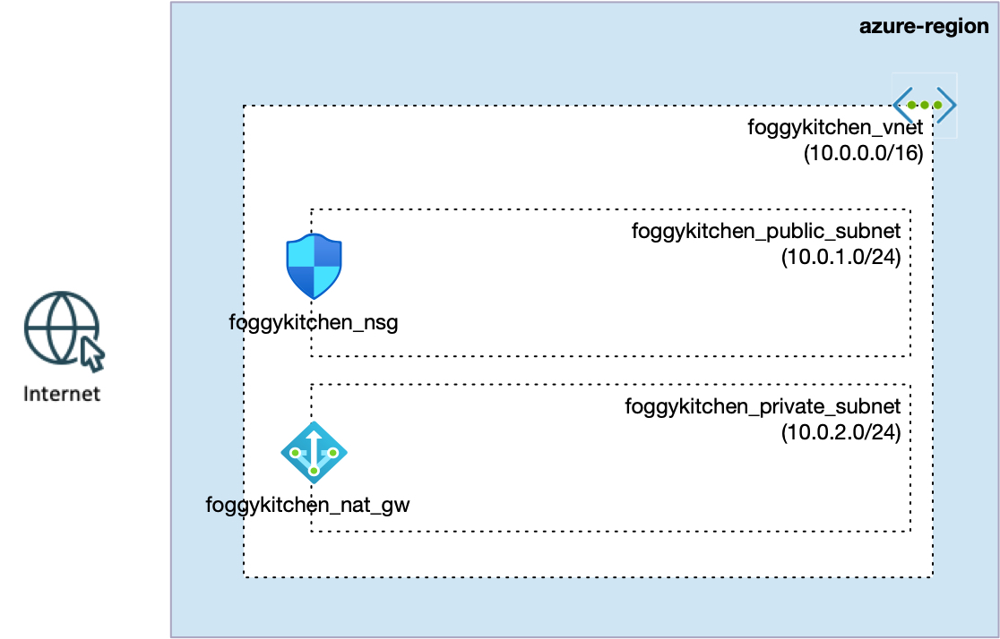

# FoggyKitchen Multicloud Course - **Module 01: Networking**

This module presents a side-by-side comparison of basic network topologies deployed in **Oracle Cloud Infrastructure (OCI)** and **Microsoft Azure**, using **Terraform or OpenTofu** as Infrastructure-as-Code (IaC) tools.

Both setups follow the same logical design:

- One **virtual network** (VCN in OCI, VNet in Azure) with CIDR block `10.0.0.0/16`
- One **public subnet** (`10.0.1.0/24`)
- One **private subnet** (`10.0.2.0/24`)
- A **NAT Gateway** for outbound connectivity from the private subnet
- A **Security List** (OCI) or **Network Security Group (Azure)** permitting selected inbound/outbound traffic

Each cloud uses cloud-native constructs and routing components like **Internet Gateway**, **Route Tables**, **NAT Gateway**, etc.

---

## 📁 Structure

```
module-01-networking/
├── azure/   --> Terraform code for Azure deployment
└── oci/     --> Terraform code for OCI deployment
```

---

## 📸 Topology Diagrams

### Oracle Cloud Infrastructure (OCI)


### Microsoft Azure


---

## ✅ How to Use

1. Choose your preferred cloud provider (OCI or Azure).
2. Navigate to the appropriate subdirectory (`oci` or `azure`).
3. Follow the `README.md` instructions inside that directory to deploy using Terraform or OpenTofu.

---

## 🧠 Purpose

This exercise demonstrates how to build equivalent infrastructure in two major cloud platforms using open, declarative tooling. It's ideal for:

- Cloud architects exploring multicloud patterns
- Azure engineers wanting to learn OCI (and vice versa)
- Practitioners practicing Infrastructure-as-Code across providers

---

## 🌐 Learn More

Visit [FoggyKitchen.com](https://foggykitchen.com) for in-depth courses, real-world scenarios, and full training bundles.

Licensed under the Universal Permissive License (UPL), Version 1.0.
