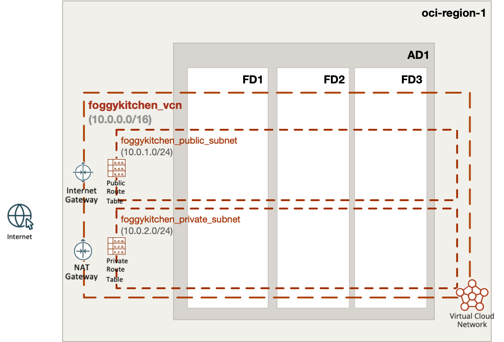

# FoggyKitchen Multicloud Course – OCI Edition - **Module 01: Networking**



## 🌐 Objective

In this module, we will build the foundational networking layer in Oracle Cloud Infrastructure (OCI), equivalent to a standard VNet setup in Azure. This includes:

- A new compartment (optional, created via Terraform)
- A Virtual Cloud Network (VCN)
- Public and private subnets
- An Internet Gateway for public access
- A NAT Gateway for private egress
- Two route tables (public and private)
- A basic Security List for SSH access

This is the first step in building a progressively layered multicloud landscape — starting from the network base in OCI. The same logical setup will be mirrored in Azure in the corresponding `/azure/` directory.

---

## 🔐 Authentication with OCI

Before deploying this configuration, you need to authenticate with OCI. Two recommended options are available:

### Option 1: Using Environment Variables

1. Copy the example setup file:

```bash
cp setup_oci_tf_vars.sh.example setup_oci_tf_vars.sh
```

2. Edit `setup_oci_tf_vars.sh` and provide your credentials:

```bash
export TF_VAR_user_ocid="ocid1.user.oc1..*******"
export TF_VAR_tenancy_ocid="ocid1.tenancy.oc1..*******"
export TF_VAR_fingerprint="xx:xx:xx:*******:xx:xx"
export TF_VAR_private_key_path="/Users/youruser/.oci/oci_api_key.pem"
export TF_VAR_region="eu-frankfurt-1"
```

3. Load the variables:

```bash
source setup_oci_tf_vars.sh
```

### Option 2: Using `terraform.tfvars`

1. Copy the example file:

```bash
cp terraform.tfvars.example terraform.tfvars
```

2. Edit and fill in your OCI credentials:

```hcl
tenancy_ocid       = "ocid1.tenancy.oc1..*******"
user_ocid          = "ocid1.user.oc1..*******"
fingerprint        = "xx:xx:xx:*******:xx:xx"
private_key_path   = "/Users/youruser/.oci/oci_api_key.pem"
region             = "eu-frankfurt-1"
```

---

## 🚀 How to Deploy

1. Clone the repository and navigate to the module directory:

```bash
git clone https://github.com/mlinxfeld/foggykitchen_multicloud.git
cd foggykitchen_multicloud/module-01-networking/oci/
```

2. Initialize the Terraform or OpenTofu project:

```bash
terraform init
# or
tofu init
```

3. Plan the infrastructure:

```bash
terraform plan
# or
tofu plan
```

4. Apply the configuration:

```bash
terraform apply
# or
tofu apply
```

5. Clean up resources when finished:

```bash
terraform destroy
# or
tofu destroy
```

---

## 📘 Next Steps

After completing this networking layer, you will be able to:

- Deploy compute instances into public or private subnets
- Add a Load Balancer in the next module
- Compare this setup directly with Azure’s equivalent under `/azure/`
- Explore advanced topics like cross-region deployment, tagging, and security automation

---

## 📣 Contributing

This is an open learning project — contributions are welcome!  
Submit a pull request or check out [FoggyKitchen.com](https://foggykitchen.com/) for more updates.

## 🪪 License
Copyright (c) 2025 [FoggyKitchen.com](https://foggykitchen.com/)

Licensed under the Universal Permissive License (UPL), Version 1.0.  
See [LICENSE](../../LICENSE) for details.