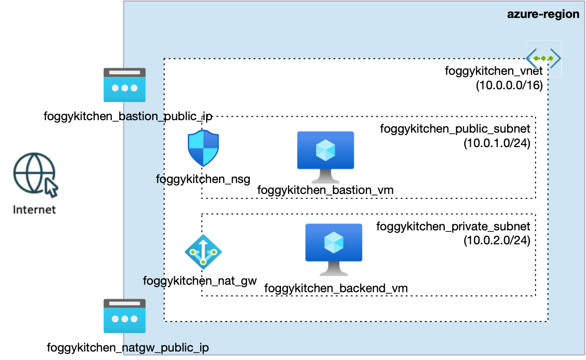

# FoggyKitchen Multicloud Course – Module 02: Compute

This module presents a side-by-side comparison of a basic compute layer deployed in **Oracle Cloud Infrastructure (OCI)** and **Microsoft Azure**, using Terraform or OpenTofu as Infrastructure-as-Code (IaC) tools.

Both environments build upon the networking topologies defined in **Module 01**, introducing **two virtual machines (VMs)**:
- A **bastion host VM** deployed in the public subnet (with public IP).
- A **backend VM** deployed in the private subnet (with no public IP).

The goal is to enable secure SSH access to the backend VM via the bastion host using a shared SSH key pair generated by Terraform.

---

## 🖥️ Logical Design

- Bastion VM in public subnet with public IP
- Backend VM in private subnet
- Shared VCN/VNet and subnet layout from Module 01
- Ingress SSH access (port 22) to bastion VM only
- No inbound access to backend VM (only via bastion)
- Same VM size and image family used in both clouds

---

## 📁 Structure

```
module-02-compute/
├── azure/   --> Terraform code for Azure deployment
└── oci/     --> Terraform code for OCI deployment
```

---

## 📸 Topology Diagrams

### Oracle Cloud Infrastructure (OCI)


### Microsoft Azure


---

## ✅ How to Use

1. Choose your cloud provider: `oci/` or `azure/`
2. Navigate into the directory and follow the instructions in `README.md`
3. Run Terraform or OpenTofu to deploy the infrastructure

---

## 🧠 Purpose

This hands-on module helps you:

- Understand how to implement bastion-based access in both clouds
- Practice SSH key provisioning and secure access design
- Gain deeper skills in deploying and securing compute resources across OCI and Azure

---

## 🌐 Learn More

Visit [FoggyKitchen.com](https://foggykitchen.com) for full courses, multicloud labs, and more training content.

---

## 🪪 License

Licensed under the Universal Permissive License (UPL), Version 1.0.  
See [LICENSE](../LICENSE) for more details.

