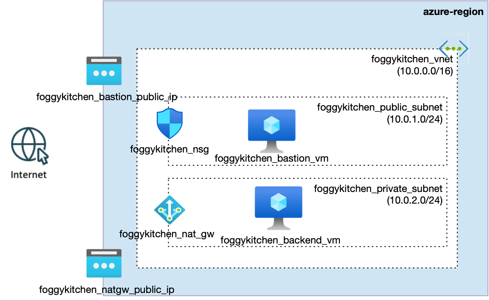

# FoggyKitchen Multicloud Course – Azure Edition - **Module 02: Compute**



---

## ⚙️ Objective

In this module, we extend the basic networking setup by launching two Linux virtual machines in Microsoft Azure:

- **foggykitchen_bastion_vm** – deployed in the public subnet with a public IP address  
- **foggykitchen_backend_vm** – deployed in the private subnet with no public IP  

The Bastion VM serves as a jump host to securely access the Backend VM. The Backend VM has outbound connectivity to the Internet through a NAT Gateway but is not exposed publicly.

This setup mimics the classic bastion + private backend pattern and mirrors the same structure created in the `/oci` directory for Oracle Cloud Infrastructure.

---

## 📦 Resources Created

- 1x **Azure Resource Group**
- 1x **Virtual Network (VNet)**
- 1x **Public Subnet**
- 1x **Private Subnet**
- 1x **Network Security Group (NSG)**
- 1x **Public IP for Bastion**
- 1x **NAT Gateway for outbound connectivity**
- 2x **Network Interfaces**
- 2x **Linux Virtual Machines**
- SSH key pair (generated via `tls_private_key`)

---

## 🧠 Prerequisites

- Azure Subscription  
- Service Principal credentials with Contributor role  
- Terraform or OpenTofu installed  

---

## 🔐 Authentication with Azure

Make sure the following environment variables are set or define them in `terraform.tfvars`:

```hcl
client_id       = "your-app-id"
client_secret   = "your-client-secret"
tenant_id       = "your-tenant-id"
subscription_id = "your-subscription-id"
```

---

## 🚀 How to Deploy

1. Clone the repo and navigate to this module:

```bash
git clone https://github.com/mlinxfeld/foggykitchen_multicloud.git
cd foggykitchen_multicloud/module-02-compute/azure/
```

2. Initialize Terraform/OpenTofu:

```bash
terraform init
# or
tofu init
```

3. Plan the deployment:

```bash
terraform plan
# or
tofu plan
```

4. Apply the infrastructure:

```bash
terraform apply
# or
tofu apply
```

5. Connect to the Bastion VM:

```bash
ssh -i id_rsa opc@<public-ip>
```

Then SSH from Bastion to Backend VM using the private IP.

6. When you're done, destroy resources:

```bash
terraform destroy
# or
tofu destroy
```

---

## 🔁 Related Modules

- [module-01-networking/azure](../module-01-networking/azure/) – foundational network
- [module-02-compute/oci](../module-02-compute/oci/) – same scenario in Oracle Cloud Infrastructure

---

## 📣 Contributing

This project is part of a multicloud educational series. Contributions are welcome!  
Visit [FoggyKitchen.com](https://foggykitchen.com/) to learn more or submit pull requests via GitHub.

---

## 🪪 License
Copyright (c) 2025 [FoggyKitchen.com](https://foggykitchen.com/)

Licensed under the Universal Permissive License (UPL), Version 1.0.  
See [LICENSE](../../LICENSE) for details.
