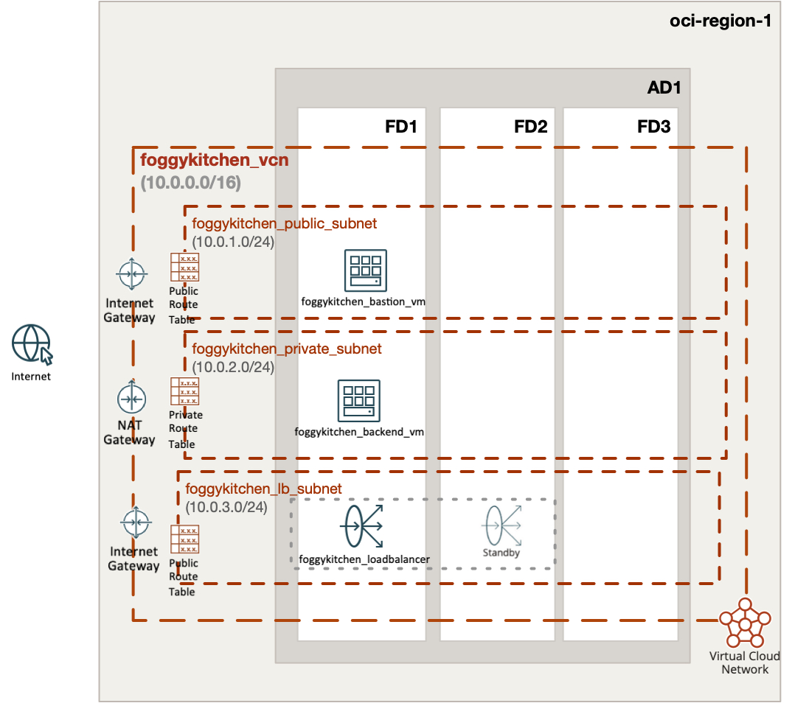
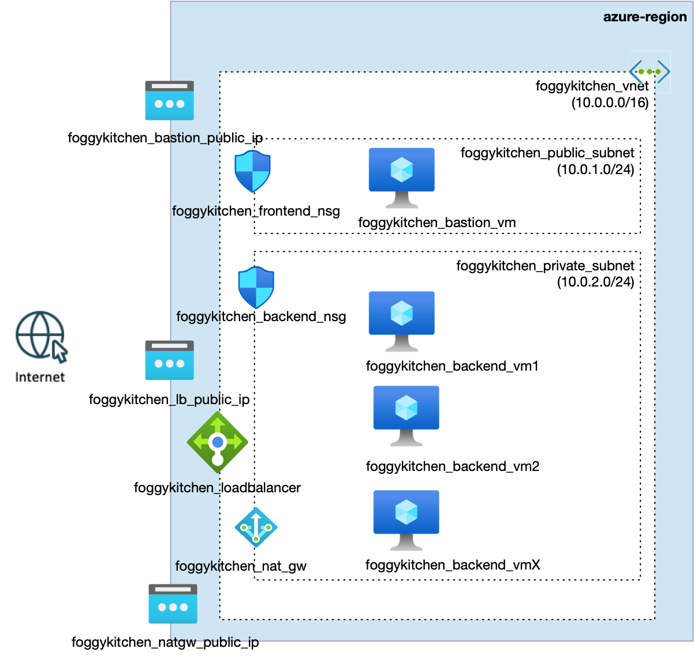

# FoggyKitchen Multicloud Course – Module 03: Load Balancer

This module demonstrates the deployment of highly available web infrastructure in both **Oracle Cloud Infrastructure (OCI)** and **Microsoft Azure**, using Terraform or OpenTofu.

Building upon the networking and compute layers from previous modules, we introduce:
- A **public Load Balancer** (LB)
- **Two backend VMs** (in private subnets) configured with web servers (NGINX or Apache)
- **Health checks** (HTTP probe in Azure, Health Check in OCI)
- Secure **SSH bastion access**

---

## 🖥️ Logical Design

- Public Load Balancer listening on port 80 (HTTP)
- Two backend VMs (web servers) deployed across Fault Domains or Availability Domains
- Bastion VM in the public subnet for SSH access
- Backend VMs in private subnet, only accessible via LB or SSH from bastion
- Outbound access via NAT Gateway
- NSG/Security List rules allow traffic as needed for health probes and LB

---

## 📁 Structure

```
module-03-loadbalancer/
├── azure/   --> Terraform code for Azure Load Balancer scenario
└── oci/     --> Terraform code for OCI Load Balancer scenario
```

---

## 📸 Topology Diagrams

### Oracle Cloud Infrastructure (OCI)


### Microsoft Azure


---

## ✅ How to Use

1. Choose your preferred cloud provider directory: `oci/` or `azure/`
2. Follow the instructions in the corresponding `README.md`
3. Use `terraform` or `tofu` to deploy the setup

---

## 🧠 Purpose

This module provides hands-on experience in:

- Designing and deploying Load Balancers in OCI and Azure
- Setting up high availability with multiple backend servers
- Understanding how traffic flows from public internet to private compute
- Practicing multicloud implementation of the same pattern

---

## 🌐 Learn More

Explore more multicloud learning paths and OCI/Azure content at [FoggyKitchen.com](https://foggykitchen.com)

---

## 🪪 License

Licensed under the Universal Permissive License (UPL), Version 1.0.  
See [LICENSE](../LICENSE) for more details.

