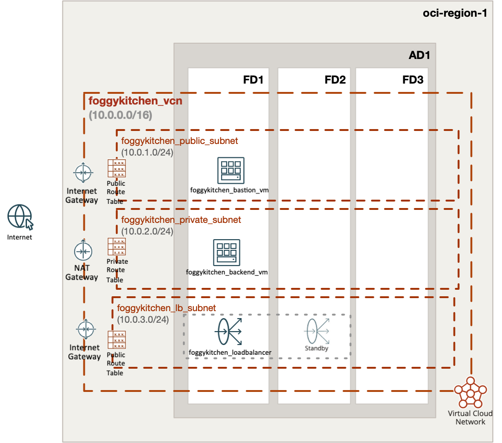

# FoggyKitchen Multicloud Course – OCI Edition - **Module 03: Load Balancer**



---

## ⚙️ Objective

In this module, we build on top of the compute and networking foundation by introducing **OCI Load Balancer** in front of two backend virtual machines.

We deploy:

- Two **foggykitchen_backend_vm** instances in the private subnet
- An **OCI Load Balancer** in the public subnet with a public IP address
- A **Backend Set** with a Health Check (TCP:80)
- A **Listener** that routes HTTP traffic to backend VMs
- An optional **Bastion VM** for SSH access

The load balancer evenly distributes HTTP requests across the backend instances. The backend subnet is secured using security lists and route tables.

This mirrors the same setup created in the `/azure` directory using Azure Load Balancer.

---

## 🔐 Authentication with OCI

Before deploying this configuration, you need to authenticate with OCI. Two recommended options are available:

### Option 1: Using Environment Variables

1. Copy the example setup file:

```bash
cp setup_oci_tf_vars.sh.example setup_oci_tf_vars.sh
```

2. Edit `setup_oci_tf_vars.sh` and provide your credentials:

```bash
export TF_VAR_user_ocid="ocid1.user.oc1..*******"
export TF_VAR_tenancy_ocid="ocid1.tenancy.oc1..*******"
export TF_VAR_fingerprint="xx:xx:xx:*******:xx:xx"
export TF_VAR_private_key_path="/Users/youruser/.oci/oci_api_key.pem"
export TF_VAR_region="eu-frankfurt-1"
```

3. Load the variables:

```bash
source setup_oci_tf_vars.sh
```

### Option 2: Using `terraform.tfvars`

1. Copy the example file:

```bash
cp terraform.tfvars.example terraform.tfvars
```

2. Edit and fill in your OCI credentials:

```hcl
tenancy_ocid       = "ocid1.tenancy.oc1..*******"
user_ocid          = "ocid1.user.oc1..*******"
fingerprint        = "xx:xx:xx:*******:xx:xx"
private_key_path   = "/Users/youruser/.oci/oci_api_key.pem"
region             = "eu-frankfurt-1"
```

---

## 🚀 How to Deploy

1. Clone the repository and navigate to the module directory:

```bash
git clone https://github.com/mlinxfeld/foggykitchen_multicloud.git
cd foggykitchen_multicloud/module-03-loadbalancer/oci/
```

2. Initialize the Terraform or OpenTofu project:

```bash
terraform init
# or
tofu init
```

3. Plan the infrastructure:

```bash
terraform plan
# or
tofu plan
```

4. Apply the configuration:

```bash
terraform apply
# or
tofu apply
```

5. Clean up resources when finished:

```bash
terraform destroy
# or
tofu destroy
```
---

## 🔁 Related Modules

- [module-01-networking/oci](../../module-01-networking/oci/) – foundational network
- [module-02-compute/oci](../../module-02-compute/oci/) – compute layer
- [module-03-loadbalancer/azure](../azure/) – same scenario in Microsoft Azure

---

## 📣 Contributing

This project is part of a multicloud educational series. Contributions are welcome!  
Visit [FoggyKitchen.com](https://foggykitchen.com/courses/new-multicloud-foundations-azure-oci-deployed-with-terraform-opentofu/) to learn more or submit pull requests via GitHub.

---

## 🪪 License
Copyright (c) 2025 [FoggyKitchen.com](https://foggykitchen.com/)

Licensed under the Universal Permissive License (UPL), Version 1.0.  
See [LICENSE](../../LICENSE) for details.
