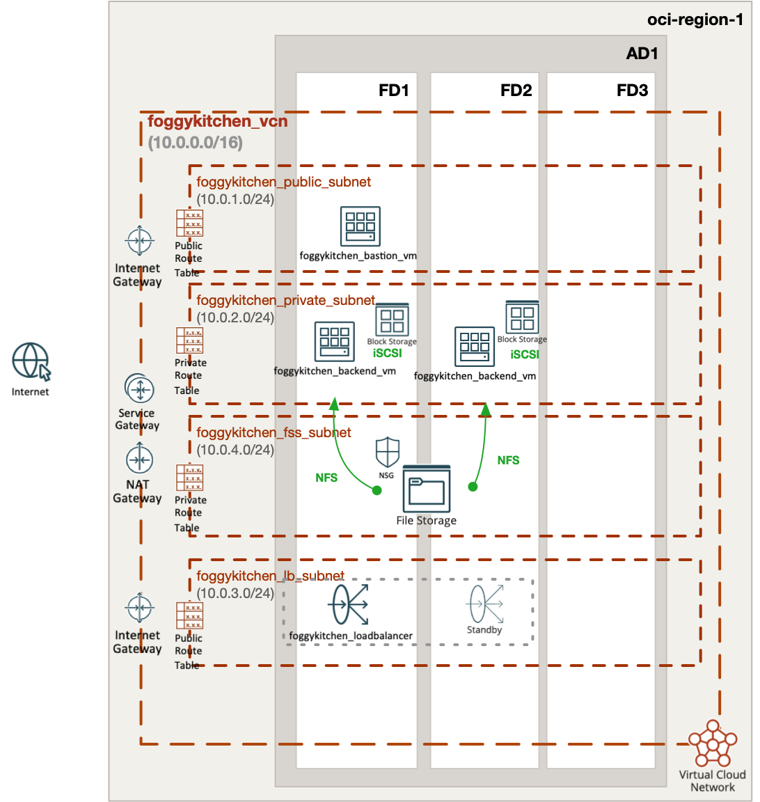

# FoggyKitchen Multicloud Course – Module 04: Shared Storage and Load Balancing

This module demonstrates how to deploy virtual machines with **attached storage** and **shared network file system (NFS)** mounts in both **Oracle Cloud Infrastructure (OCI)** and **Microsoft Azure**, using Terraform or OpenTofu.

It builds upon previous modules and introduces:

- **Managed block storage** attached to backend virtual machines
- A **shared NFS mount** backed by File Storage (OCI) or Azure File Share (Azure)
- Access provisioning via **Bastion Host**
- Private network communication and optional load balancing integration

---

## 🖥️ Logical Design

- Backend virtual machines provisioned in private subnet
- Each VM receives a dedicated **managed disk** (block storage)
- All VMs also mount a **shared file system** (via NFS)
- Storage access secured via network rules and optionally private endpoints
- Bastion host in public subnet for provisioning and debugging access
- Outbound internet access via **NAT Gateway**

---

## 📁 Structure

```
module-04-storage/
├── azure/   --> Terraform code for shared storage scenario in Azure
└── oci/     --> Terraform code for shared storage scenario in OCI
```

---

## 📸 Topology Diagrams

### Oracle Cloud Infrastructure (OCI)


### Microsoft Azure


---

## ✅ How to Use

1. Choose your cloud provider directory: `oci/` or `azure/`
2. Follow the instructions in the respective `README.md`
3. Use `terraform` or `tofu` to deploy the infrastructure

---

## 🧠 Purpose

This module helps you:

- Understand **storage provisioning patterns** in OCI and Azure
- Practice **mounting shared NFS** volumes across VMs
- Compare **multicloud infrastructure strategies** using block and network storage
- Learn how to secure and manage storage at scale

---

## 🌐 Learn More

Visit [FoggyKitchen.com](https://foggykitchen.com) for more multicloud learning paths, labs, and resources.

---

## 🪪 License

Licensed under the Universal Permissive License (UPL), Version 1.0.  
See [LICENSE](../LICENSE) for more details.

