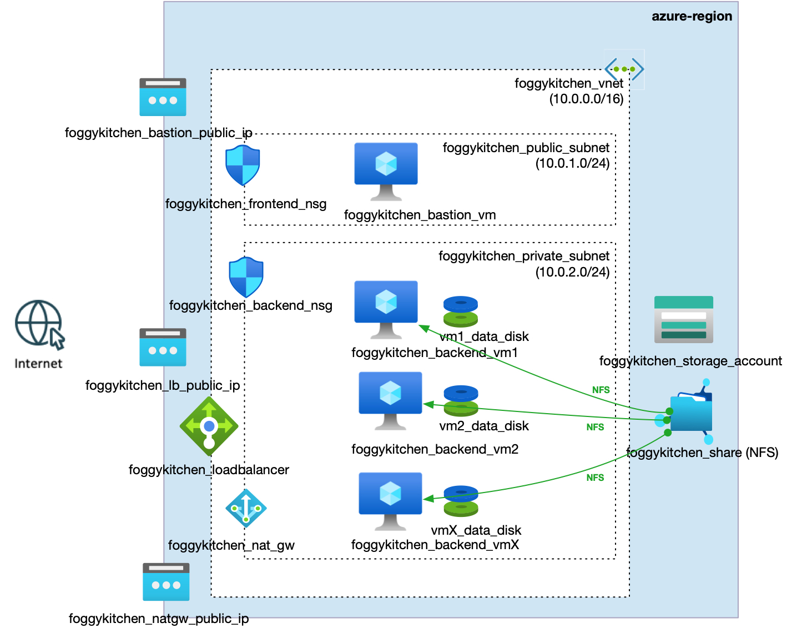

# FoggyKitchen Multicloud Course – Azure Edition  **Module 04: Shared Storage**



---

## ⚙️ Objective

This module demonstrates how to deploy a Standard Public Load Balancer in Microsoft Azure that distributes HTTP traffic to backend Linux virtual machines located in a private subnet.

Each backend VM has:
- a mounted **block storage disk** (`/u01`) formatted with `ext4`
- a mounted **shared NFS file share** (`/mount/sharedfs`) hosted on an Azure Storage Account and accessed via **Private Endpoint**

Key components:

- **foggykitchen_lb** – Standard Public Load Balancer
- **foggykitchen_backend_vm1 / vm2** – VMs in private subnet behind the LB
- **foggykitchen_backend_vm_data_disk** – managed disks (block storage) attached and mounted as `/u01` on backend VMs
- **foggykitchen_nat_gw** – NAT Gateway for outbound internet access
- **foggykitchen_bastion_vm** – SSH jump host in public subnet
- **foggykitchenstorage** – Azure Storage Account with NFS file share
- **Private Endpoint** – secures access to the file share from private subnet only

---

## 🔐 Authentication with Azure

Make sure you're authenticated before running Terraform/OpenTofu:

```bash
az login
```

If you're using a service principal, ensure appropriate environment variables are set (`ARM_CLIENT_ID`, `ARM_CLIENT_SECRET`, etc.).

---

## 🚀 How to Deploy

1. Clone the repository and navigate to this module:

```bash
git clone https://github.com/mlinxfeld/foggykitchen_multicloud.git
cd foggykitchen_multicloud/module-04-storage/azure/
```

2. Create your `terraform.tfvars` file:

```hcl
client_ip     = "YOUR_PUBLIC_IP"
node_count    = 2
disk_size_gb  = 50
use_zones     = true
disk_sku      = "Premium_LRS"
```

3. Initialize Terraform/OpenTofu:

```bash
tofu init
```

4. Plan and apply the infrastructure:

```bash
tofu plan
tofu apply
```

5. Verify storage:

- Log in to Bastion and SSH into backend VMs.
- You should see:
  - `/u01` – formatted and mounted block storage disk
  - `/mount/sharedfs/index.html` – shared file between both backend VMs

6. Test Load Balancer:

```bash
curl http://<load_balancer_public_ip>
```

You should see:

```html
Welcome to FoggyKitchen.com! These are both WEBSERVERS under LB umbrella with shared index.html ...
```

7. Destroy resources when finished:

```bash
tofu destroy
```

---

## 🔁 Related Modules

- [module-01-networking/azure](../../module-01-networking/azure/) – foundational virtual network with public and private subnets
- [module-02-compute/azure](../../module-02-compute/azure/) – bastion host and backend VMs deployment
- [module-03-loadbalancer/azure](../../module-03-loadbalancer/azure/) – public Load Balancer directing traffic to backend VMs
- [module-04-storage/oci](../oci/) – same storage scenario deployed in Oracle Cloud Infrastructure

---

## 📣 Contributing

This project is part of the [FoggyKitchen.com](https://foggykitchen.com/) multicloud training series.  
Feel free to open issues or submit pull requests.

---

## 🪪 License

© 2025 [FoggyKitchen.com](https://foggykitchen.com/)  
Licensed under the Universal Permissive License (UPL), Version 1.0.  
See [LICENSE](../../LICENSE) for full details.

