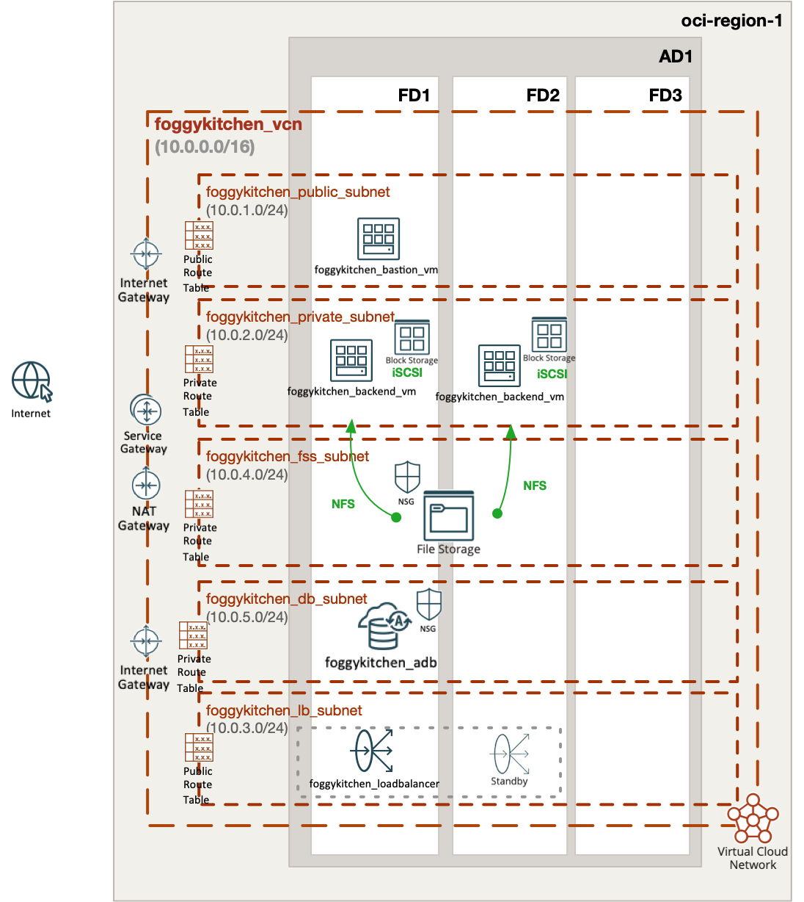
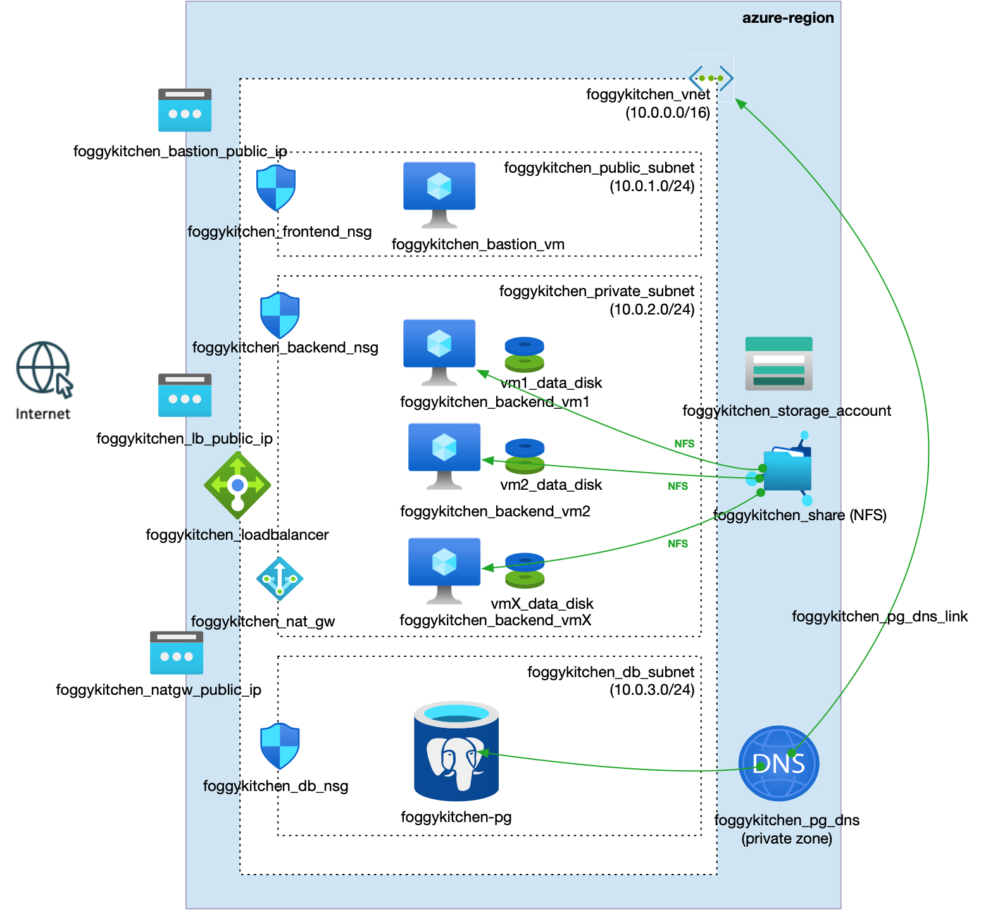

# FoggyKitchen Multicloud Course – Module 05: Database Layer

This module demonstrates how to deploy **database services** in both **Oracle Cloud Infrastructure (OCI)** and **Microsoft Azure**, using Terraform or OpenTofu.

It builds upon previous modules and introduces:

- A **managed PostgreSQL-compatible database** (Autonomous Database in OCI, Flexible Server in Azure)
- Deployment inside a **dedicated subnet**, isolated from general compute resources
- Secure **private access** from backend VMs in the private subnet
- Use of **bastion host** for provisioning and connectivity testing

---

## 🖥️ Logical Design

- Database servers are deployed inside dedicated subnets for improved isolation
- Each backend VM (from previous modules) can access the database privately
- No public access is allowed to the database layer
- Backend services can connect via private IP or internal DNS
- Optional provisioning of schema or test tables from backend VMs

---

## 📁 Structure

```
module-05-database/
├── azure/   --> Terraform code for Azure PostgreSQL Flexible Server
└── oci/     --> Terraform code for OCI Autonomous Database
```

---

## 📸 Topology Diagrams

### Oracle Cloud Infrastructure (OCI)


### Microsoft Azure


---

## ✅ How to Use

1. Choose your cloud provider directory: `oci/` or `azure/`
2. Follow the instructions in the respective `README.md`
3. Use `terraform` or `tofu` to deploy the database layer

---

## 🧠 Purpose

This module helps you:

- Learn how to provision **managed databases** in OCI and Azure
- Practice **secure, private connectivity** between backend and database layers
- Understand **multicloud design principles** for persistence and isolation
- Prepare for more advanced scenarios involving shared data services

---

## 🌐 Learn More

Visit [FoggyKitchen.com](https://foggykitchen.com) for more multicloud tutorials, labs, and educational content.

---

## 🪪 License

Licensed under the Universal Permissive License (UPL), Version 1.0.  
See [LICENSE](../LICENSE) for more details.
