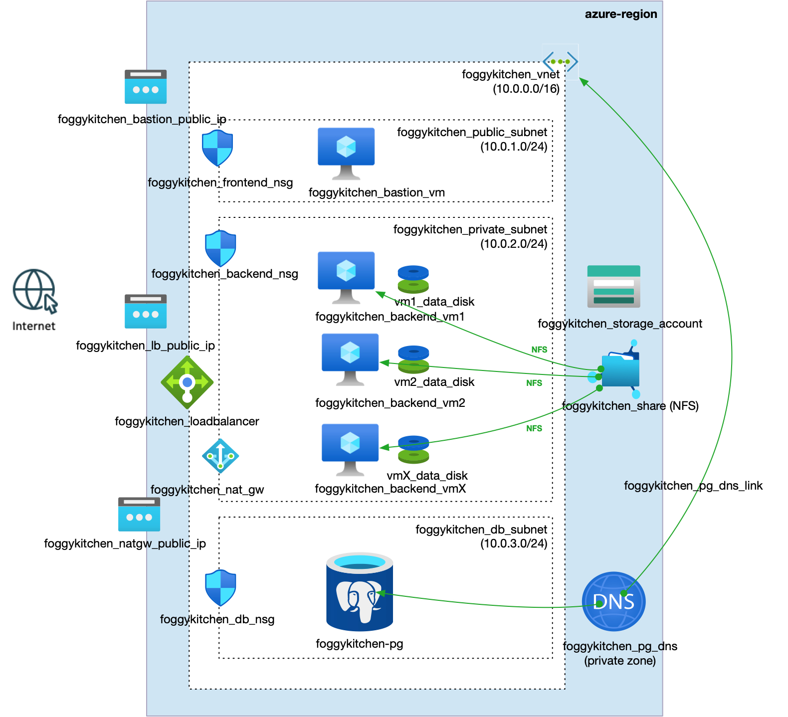

# FoggyKitchen Multicloud Course – Azure Edition – **Module 05: Database**



---

## ⚙️ Objective

In this final module of the foundational Azure path, we extend our infrastructure with **persistence services**:

- A **managed PostgreSQL flexible server** hosted in a dedicated subnet
- **Private access** via subnet-level delegation and private DNS
- Secure database architecture for backend applications deployed in previous modules

This setup reflects realistic, secure deployments of backend systems using cloud-native managed databases.

---

## 🧱 Architecture Components

- `foggykitchen_pg` – Azure Database for PostgreSQL (flexible server), deployed in its own **db subnet**
- `foggykitchen_db_subnet` – isolated subnet delegated to PostgreSQL with private network access only
- Private DNS zone `privatelink.postgres.database.azure.com` is **auto-linked**
- Backend VMs in the private subnet can connect securely to the database using DNS resolution
- All traffic is internal – no public access to the database

---

## 🚀 How to Deploy

1. Navigate to this module:

```bash
cd foggykitchen_multicloud/module-05-database/azure/
```

2. Initialize Terraform/OpenTofu:

```bash
tofu init
# or
terraform init
```

3. Plan the changes:

```bash
tofu plan
# or
terraform plan
```

4. Apply the infrastructure:

```bash
tofu apply
# or
terraform apply
```

---

## 📁 New Elements Introduced

- **Azure PostgreSQL Flexible Server**: Managed PostgreSQL with high security and private access
- **Delegated Subnet**: Special delegation to `Microsoft.DBforPostgreSQL/flexibleServers`
- **Private DNS Zone Binding**: Internal name resolution via `*.postgres.database.azure.com`

---

## 🧠 Learning Goals

- Understand how to securely deploy databases in Azure
- Use subnet delegation and private endpoints to enforce isolation
- Combine storage and compute with persistence services
- Mirror equivalent setup from OCI (Autonomous DB Serverless) in Azure

---

## 🧹 Cleanup

When done, destroy the resources:

```bash
tofu destroy
# or
terraform destroy
```

---

## 🔁 Related Modules

- [module-01-networking/azure](../../module-01-networking/azure/) – foundational network (VNets and subnets)
- [module-02-compute/azure](../../module-02-compute/azure/) – VMs and Bastion
- [module-03-loadbalancer/azure](../../module-03-loadbalancer/azure/) – public Load Balancer
- [module-04-storage/azure](../../module-04-storage/azure/) – shared and block storage
- [module-05-database/oci](../oci/) – same concept in Oracle Cloud (Autonomous DB Serverless)

---

## 🌐 Learn More

Visit [FoggyKitchen.com](https://foggykitchen.com/courses/new-multicloud-foundations-azure-oci-deployed-with-terraform-opentofu/) for multicloud tutorials, diagrams, and courses.

---

## 🪪 License

Licensed under the Universal Permissive License (UPL), Version 1.0.  
See [LICENSE](../../LICENSE) for more details.

