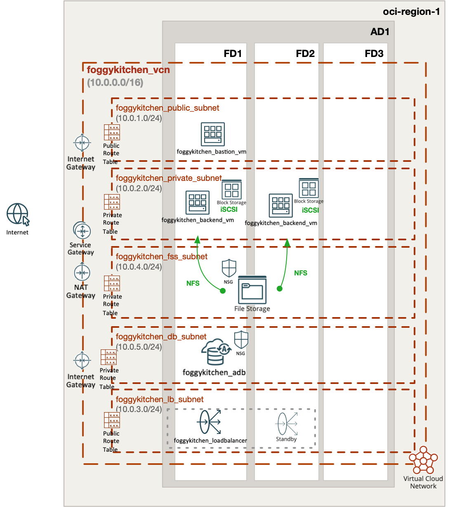

# FoggyKitchen Multicloud Course – OCI Edition - **Module 05: Database**



---

## ⚙️ Objective

In this module, we extend the OCI architecture with the **persistence layer** by deploying:

- **Autonomous Database Serverless (ADB-S)** inside a dedicated subnet
- Continued use of **Block Storage (iSCSI)** and **File Storage (NFS)** for backend VMs
- Full segregation of storage components by subnet and security groups

This demonstrates how to integrate a fully managed Oracle Database with other storage options in a highly available multicloud-ready environment.

---

## 🧱 Architecture Components

- `foggykitchenadbs` is an **Autonomous Database Serverless** instance deployed in `foggykitchen_db_subnet`
- A dedicated subnet (`foggykitchen_db_subnet`) isolates database traffic
- Existing backend VMs still leverage:
  - **iSCSI Block Volumes** (for persistent data)
  - **OCI File Storage** (NFS) shared between them
- All database and file storage components are protected by **dedicated NSGs**
- The entire topology spans multiple **Fault Domains** for high availability

---

## 🛠️ How to Deploy

1. Navigate to this module:

```bash
cd foggykitchen_multicloud/module-05-database/oci/
```

2. Initialize OpenTofu/Terraform:

```bash
tofu init
# or
terraform init
```

3. Plan the changes:

```bash
tofu plan
# or
terraform plan
```

4. Apply the infrastructure:

```bash
tofu apply
# or
terraform apply
```

---

## 📁 New Elements Introduced

- **foggykitchenadbs**: Fully managed Autonomous Database Serverless
- **foggykitchen_db_subnet**: New subnet for the ADB instance
- **NSG for ADB Subnet**: Custom network security for database access

---

## 🧠 Learning Goals

- Understand Autonomous Database deployment in OCI
- Structure your cloud network using purpose-specific subnets
- Practice secure and modular persistence layer design
- Combine database, file, and block storage in one architecture

---

## 🧹 Cleanup

When done, remove the resources:

```bash
tofu destroy
# or
terraform destroy
```

---

## 🔁 Related Modules

- [module-01-networking/oci](../../module-01-networking/oci/) – foundational network setup with route tables and gateways
- [module-02-compute/oci](../../module-02-compute/oci/) – backend virtual machines and bastion host
- [module-03-loadbalancer/oci](../../module-03-loadbalancer/oci/) – public Load Balancer setup
- [module-04-storage/oci](../../module-04-storage/oci/) – persistent block and file storage

---

## 🌐 Learn More

Visit [FoggyKitchen.com](https://foggykitchen.com/courses/new-multicloud-foundations-azure-oci-deployed-with-terraform-opentofu/) for multicloud tutorials, diagrams, and videos.

---

## 🪪 License

Licensed under the Universal Permissive License (UPL), Version 1.0.  
See [LICENSE](../../LICENSE) for more details.
