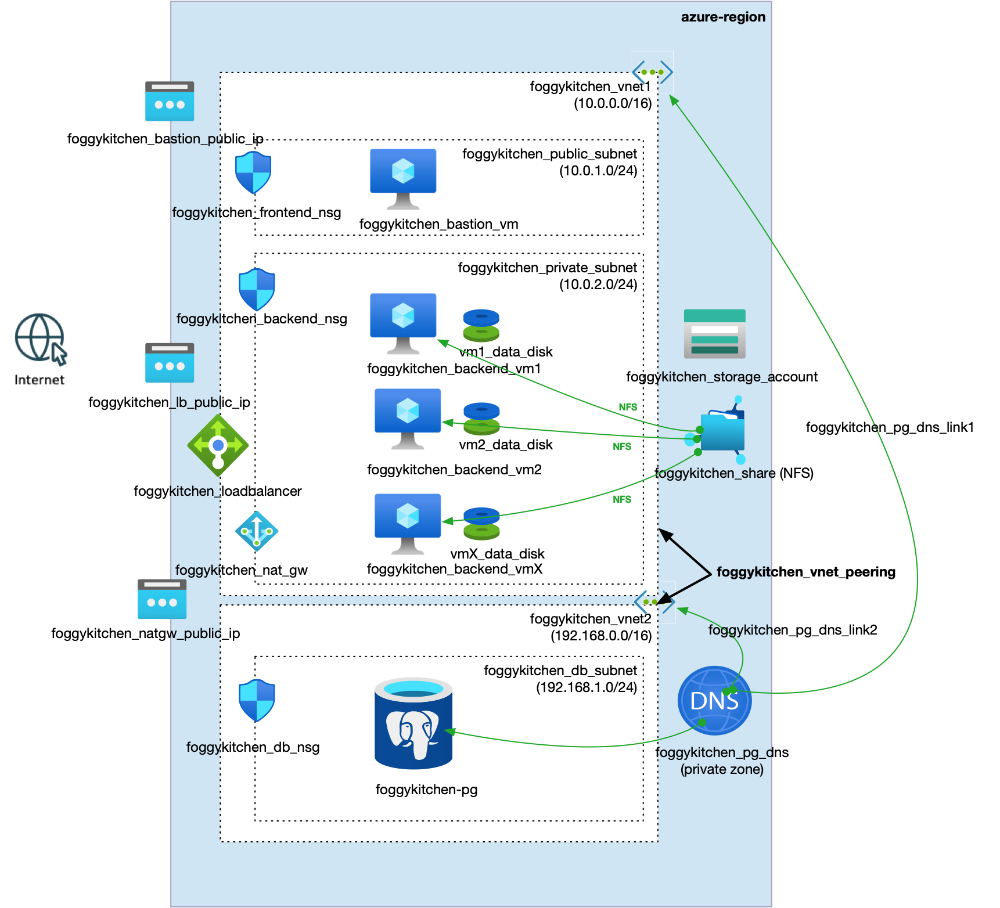

# FoggyKitchen Multicloud Course – Module 06: Local Peering

This module demonstrates how to configure **local peering** between Virtual Networks (VNets in Azure) or Virtual Cloud Networks (VCNs in OCI) using Terraform or OpenTofu.

It builds on previous modules by enabling **private communication** between the application layer (backend VMs) and the database tier across separate networks.

---

## 🖥️ Logical Design

- Application components (VMs, Load Balancer, Storage) remain in the original network (VCN1/VNet1)
- Database layer (ADB-S in OCI or PostgreSQL Flexible Server in Azure) is deployed in a new network (VCN2/VNet2)
- VCN/VNet **Peering** enables direct, private IP communication between subnets
- No public IP is required for database access
- The setup follows **network segmentation** best practices for enhanced security

---

## 📁 Structure

```
module-06-local-peering/
├── azure/   --> Terraform code for Azure VNet peering
└── oci/     --> Terraform code for OCI VCN peering
```

---

## 📸 Topology Diagrams

### Oracle Cloud Infrastructure (OCI)


### Microsoft Azure


---

## ✅ How to Use

1. Choose the appropriate subdirectory: `oci/` or `azure/`
2. Follow the `README.md` in that directory
3. Use `terraform` or `tofu` to initialize and apply the infrastructure

---

## 🧠 Purpose

This module helps you:

- Learn how to configure **VNet/VCN peering**
- Understand **network segmentation** for secure multicloud designs
- Enable **private traffic flow** between application and database layers across networks
- Prepare for more complex topologies like remote peering and hub-and-spoke

---

## 🌐 Learn More

Visit [FoggyKitchen.com](https://foggykitchen.com/) for diagrams, training, and step-by-step multicloud labs.

---

## 🪪 License

Licensed under the Universal Permissive License (UPL), Version 1.0.  
See [LICENSE](../LICENSE) for more details.

