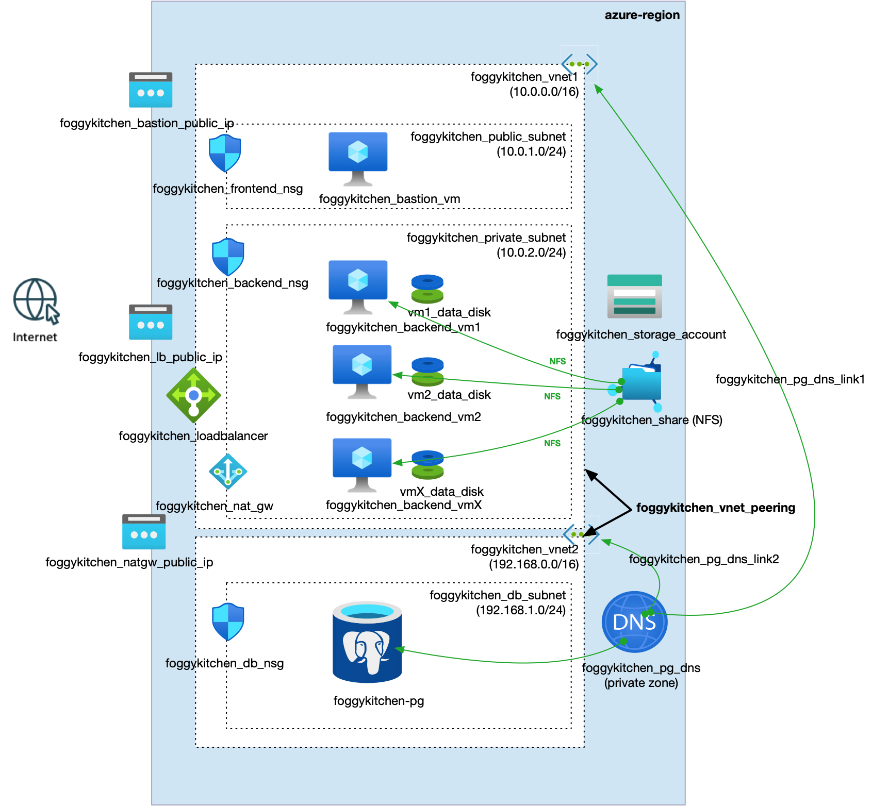

# FoggyKitchen Multicloud Course – Azure Edition – **Module 06: Local Peering**



---

## ⚙️ Objective

In this advanced module, we explore **local peering** between two Virtual Networks in Azure:

- Application stack (VMs, Load Balancer, Storage) remains in **VNet1**
- PostgreSQL Flexible Server is moved to **VNet2**
- **Peering connections** between the VNets allow private communication across subnets
- Backend VMs in VNet1 connect securely to the database in VNet2 using DNS and private IP

This reflects a common enterprise scenario where databases are isolated in separate networks for security or organizational boundaries.

---

## 🧱 Architecture Components

- `foggykitchen_vnet1` – core infrastructure: VMs, LB, storage
- `foggykitchen_vnet2` – dedicated VNet for the PostgreSQL Flexible Server
- `azurerm_virtual_network_peering` – bidirectional peering between VNet1 and VNet2
- `azurerm_private_dns_zone_virtual_network_link` – allows VNet1 to resolve internal PostgreSQL hostname
- DNS and routing fully internal; no public access is required

---

## 🚀 How to Deploy

1. Navigate to this module:

```bash
cd foggykitchen_multicloud/module-06-local-peering/azure/
```

2. Initialize Terraform/OpenTofu:

```bash
tofu init
```

3. Plan the changes:

```bash
tofu plan
```

4. Apply the infrastructure:

```bash
tofu apply
```

---

## 📁 New Elements Introduced

- **Two separate VNets**: Network-level separation of application and database
- **Local VNet Peering**: Enables private routing between subnets
- **Cross-VNet DNS linking**: Ensures PostgreSQL DNS resolution from VNet1
- **Database isolation**: PostgreSQL in a different network, accessible only from trusted peers

---

## 🧠 Learning Goals

- Understand VNet peering in Azure
- Build multi-subnet/multi-VNet topologies
- Use DNS zone linking to support private name resolution across VNets
- Apply Terraform best practices for scalable multicloud network architectures

---

## 🧹 Cleanup

When done, destroy the resources:

```bash
tofu destroy
```

---

## 🔁 Related Modules

- [module-05-database/azure](../module-05-database/azure/) – baseline PostgreSQL deployment
- [module-04-storage/azure](../module-04-storage/azure/) – block and NFS storage integration
- [module-06-local-peering/oci](../module-06-local-peering/oci/) – same concept in Oracle Cloud Infrastructure

---

## 🌐 Learn More

Visit [FoggyKitchen.com](https://foggykitchen.com/) for full courses, diagrams, and tutorials.

---

## 🪪 License

Licensed under the Universal Permissive License (UPL), Version 1.0.  
See [LICENSE](../../LICENSE) for more details.
