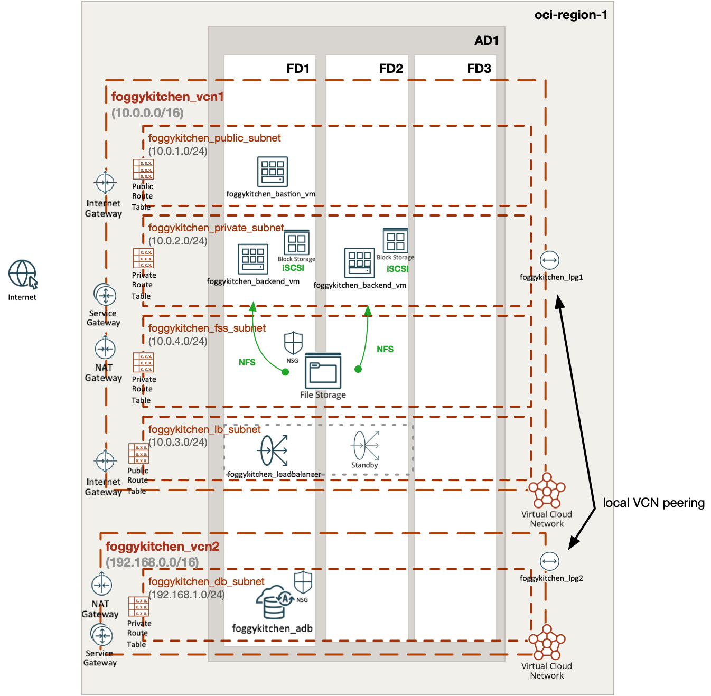

# FoggyKitchen Multicloud Course – OCI Edition - **Module 06: Local Peering**



---

## ⚙️ Objective

In this module, we extend the network architecture with **Local VCN Peering** between two Virtual Cloud Networks (VCNs) in the same region.

This allows backend services in `foggykitchen_vcn1` to securely communicate with the Autonomous Database deployed in `foggykitchen_vcn2` — without traversing the public internet.

---

## 🧱 Architecture Components

- `foggykitchen_vcn1` hosts:
  - Bastion host, backend VMs, block storage, file storage, and public Load Balancer
- `foggykitchen_vcn2` hosts:
  - Autonomous Database (ADB-S) in a dedicated subnet
- Local Peering is configured between `foggykitchen_vcn1` and `foggykitchen_vcn2` using:
  - `foggykitchen_lpg1` and `foggykitchen_lpg2` (Local Peering Gateways)
  - Correct route tables and security rules for private communication
- No public access to ADB — all communication occurs over private IPs

---

## 🛠️ How to Deploy

1. Navigate to this module:

```bash
cd foggykitchen_multicloud/module-06-local-peering/oci/
```

2. Initialize OpenTofu/Terraform:

```bash
tofu init
# or
terraform init
```

3. Plan the changes:

```bash
tofu plan
# or
terraform plan
```

4. Apply the infrastructure:

```bash
tofu apply
# or
terraform apply
```

---

## 📁 New Elements Introduced

- `foggykitchen_vcn2`: New Virtual Cloud Network with separate CIDR block
- `foggykitchen_lpg1` / `foggykitchen_lpg2`: Local Peering Gateways
- Updated route tables to enable peered traffic
- Dedicated subnet and NSG for Autonomous Database in VCN2

---

## 🧠 Learning Goals

- Understand Local VCN Peering in OCI
- Enable private communication between two VCNs
- Apply routing and security rules for cross-VCN access
- Integrate database services into multi-VCN designs

---

## 🧹 Cleanup

When done, remove the resources:

```bash
tofu destroy
# or
terraform destroy
```

---

## 🔁 Related Modules

- [module-01-networking/oci](../../module-01-networking/oci/) – foundational VCN and gateway setup
- [module-05-database/oci](../../module-05-database/oci/) – Autonomous Database deployment
- [module-02-compute/oci](../../module-02-compute/oci/) – backend VMs and bastion access

---

## 🌐 Learn More

Visit [FoggyKitchen.com](https://foggykitchen.com/) for additional Terraform modules, diagrams, and video tutorials.

---

## 🪪 License

Licensed under the Universal Permissive License (UPL), Version 1.0.  
See [LICENSE](../../LICENSE) for more details.
