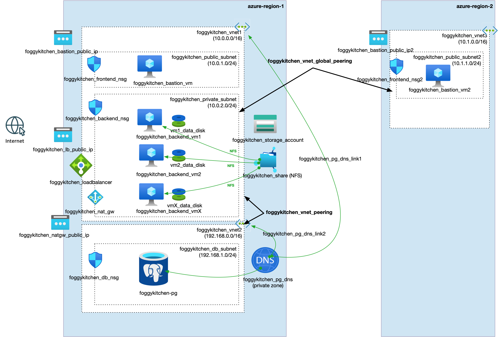

# FoggyKitchen Multicloud Course – Module 07: Cross-Region Peering

This module demonstrates how to configure **cross-region peering** in both **Oracle Cloud Infrastructure (OCI)** and **Microsoft Azure**, using Terraform or OpenTofu.

It extends the networking concepts introduced in Module 06 and shows how to enable **secure private connectivity across regions**.

---

## 🌍 Cross-Region Networking Objectives

- Establish secure communication **between regions** in the same cloud
- Explore **Remote Peering Connections (RPC)** in OCI using **Dynamic Routing Gateways (DRG)**
- Use **Global VNet Peering** in Azure for cross-region VNet connectivity
- Validate access to resources (e.g., database, backend VMs) across regional boundaries

---

## 📁 Structure

```
module-07-cross-region-peering/
├── azure/   --> Terraform code for Azure Global VNet Peering
└── oci/     --> Terraform code for OCI Remote Peering Connections (RPC)
```

---

## 🌐 Topology Diagrams

### Oracle Cloud Infrastructure (OCI)


### Microsoft Azure


---

## ✅ How to Use

1. Choose your cloud provider directory: `oci/` or `azure/`
2. Follow the instructions in the respective `README.md`
3. Use `terraform` or `tofu` to deploy cross-region connectivity

---

## 🧠 Learning Goals

- Understand **Remote Peering** with DRG and RPC in OCI
- Understand **Global VNet Peering** in Azure
- Learn to validate network reachability across regions
- Practice real-world multicloud network design patterns

---

## 🧹 Cleanup

To remove resources when finished:

```bash
tofu destroy
# or
terraform destroy
```

---

## 🔁 Related Modules

- [module-06-local-peering/oci](../module-06-local-peering/oci/) – local peering setup in OCI
- [module-06-local-peering/azure](../module-06-local-peering/azure/) – local VNet peering in Azure
- [module-01-networking/oci](../module-01-networking/oci/) – foundational VCN and DRG setup
- [module-01-networking/azure](../module-01-networking/azure/) – foundational VNet and gateway setup

---

## 🌐 Learn More

Visit [FoggyKitchen.com](https://foggykitchen.com/) for multicloud training, labs, and best practices.

---

## 🪪 License

Licensed under the Universal Permissive License (UPL), Version 1.0.  
See [LICENSE](../LICENSE) for more details.

