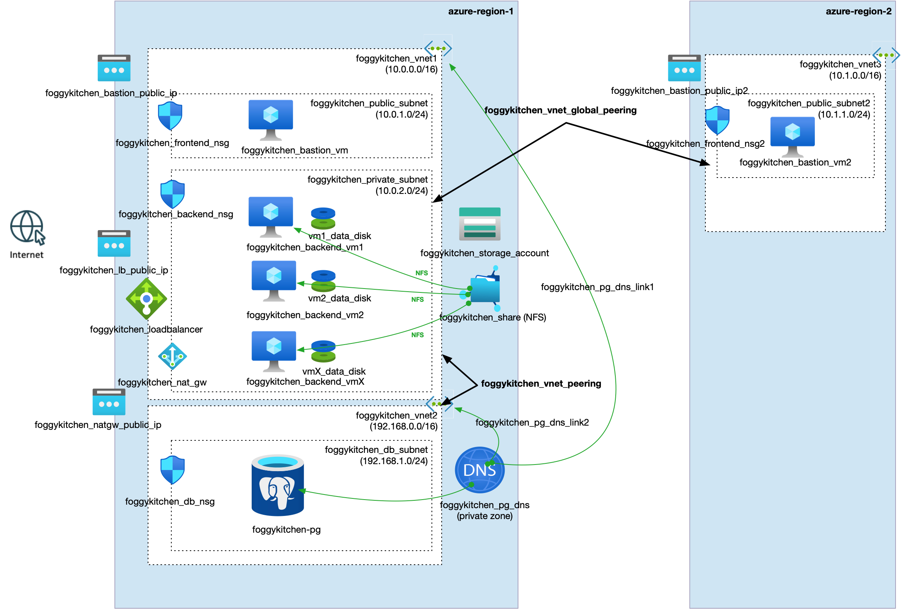

# FoggyKitchen Multicloud Course – Azure Edition – **Module 07: Cross-Region Peering**



---

## ⚙️ Objective

In this module, we introduce **cross-region peering** between Azure Virtual Networks:

- **VNet1** remains in the primary region and hosts all core components: Bastion, Load Balancer, backend VMs, and storage
- A new **VNet3** is created in a **secondary region**, hosting a public VM for testing remote access
- Bidirectional global peering is established between VNet1 and VNet3
- This setup allows public VM in region 2 to securely connect to resources in region 1 over **Azure backbone**

---

## 🧱 Architecture Components

- `foggykitchen_vnet1` (primary region):
  - Bastion host, backend virtual machines, block and file storage, public Load Balancer
- `foggykitchen_vnet3` (secondary region):
  - Public VM used for testing access across regions
- `azurerm_virtual_network_peering`:
  - Bidirectional global peering between VNet1 and VNet3
- Network Security Groups (NSGs) and routing:
  - Configured to allow access from VNet3 to backend subnet in VNet1
- Public IP for VNet3 VM enables remote SSH access for testing

---

## 🚀 How to Deploy

1. Navigate to this module:

```bash
cd foggykitchen_multicloud/module-07-cross-region-peering/azure/
```

2. Initialize Terraform/OpenTofu:

```bash
tofu init
```

3. Plan the deployment:

```bash
tofu plan
```

4. Apply the infrastructure:

```bash
tofu apply
```

---

## 📁 New Elements Introduced

- **VNet3** in a new Azure region (e.g. North Europe)
- **Cross-region VNet peering** between VNet1 and VNet3
- **Public VM** for validation and testing
- **Routing and NSG rules** to enable cross-region access

---

## 🧠 Learning Goals

- Understand cross-region global peering in Azure
- Compare global peering across regions vs. local peering
- Apply secure routing and NSG updates for multiregional network designs
- Validate connectivity across peered VNets

---

## 🧹 Cleanup

When done, remove the resources:

```bash
tofu destroy
```

---

## 🔁 Related Modules

- [module-06-local-peering/azure](../module-06-local-peering/azure/) – same concept within a single region
- [module-07-cross-region-peering/oci](../module-07-cross-region-peering/oci/) – Oracle Cloud Infrastructure version

---

## 🌐 Learn More

Visit [FoggyKitchen.com](https://foggykitchen.com/) for full multicloud courses, network diagrams, and video tutorials.

---

## 🪪 License

Licensed under the Universal Permissive License (UPL), Version 1.0.  
See [LICENSE](../../LICENSE) for more details.

