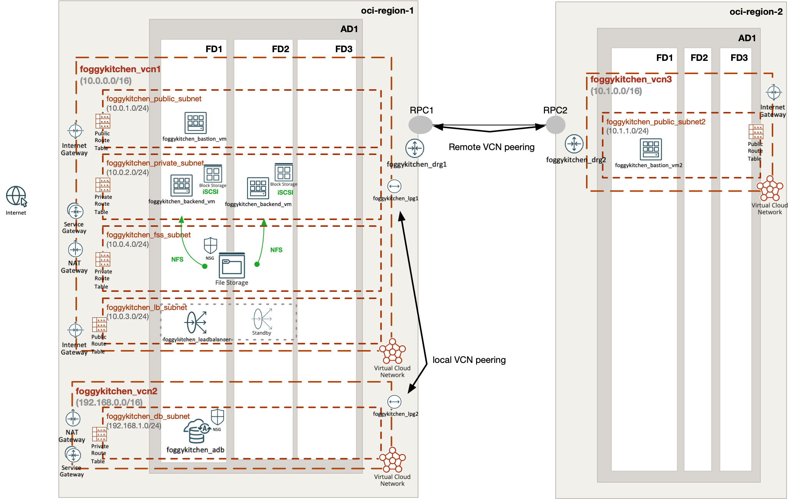

# FoggyKitchen Multicloud Course – OCI Edition **Module 07: Cross-Region Peering**



---

## ⚙️ Objective

In this module, we expand the architecture to span **multiple OCI regions** using **Remote VCN Peering**.  
This enables secure, private communication between VCNs in different regions — ideal for cross-region access to databases, file shares, or administrative bastion hosts.

---

## 🧱 Architecture Components

- **Region 1:**
  - `foggykitchen_vcn1`: Backend VMs, Bastion, File Storage, Load Balancer
  - `foggykitchen_vcn2`: Hosts the Autonomous Database (ADB)
  - `foggykitchen_drg1`: Dynamic Routing Gateway for Region 1
- **Region 2:**
  - `foggykitchen_vcn3`: New VCN with Bastion Host in `foggykitchen_public_subnet2`
  - `foggykitchen_drg2`: Dynamic Routing Gateway for Region 2

### Remote Peering:
- DRG Peering is configured between `foggykitchen_drg1` and `foggykitchen_drg2`
- Route tables are updated to forward cross-region traffic via respective DRGs

---

## 🛠️ How to Deploy

1. Navigate to this module:

```bash
cd foggykitchen_multicloud/module-07-cross-region-peering/oci/
```

2. Initialize OpenTofu/Terraform:

```bash
tofu init
# or
terraform init
```

3. Plan the changes:

```bash
tofu plan
# or
terraform plan
```

4. Apply the infrastructure:

```bash
tofu apply
# or
terraform apply
```

---

## 📁 New Elements Introduced

- `foggykitchen_vcn3`: A new VCN in a different OCI region
- `foggykitchen_drg1` / `foggykitchen_drg2`: Dynamic Routing Gateways in each region
- Remote DRG-to-DRG Peering configuration
- Updated route tables for cross-region VCN connectivity
- Public bastion host in Region 2 (`foggykitchen_bastion_vm2`)

---

## 🧠 Learning Goals

- Understand Remote VCN Peering in OCI
- Configure DRG Peering across regions
- Route traffic from one region to services in another (e.g., accessing ADB in Region 1 from Region 2)
- Compare remote vs. local peering strategies

---

## 🧹 Cleanup

To remove the infrastructure:

```bash
tofu destroy
# or
terraform destroy
```

---

## 🔁 Related Modules

- [module-06-local-peering/oci](../../module-06-local-peering/oci/) – same-region VCN peering
- [module-05-database/oci](../../module-05-database/oci/) – Autonomous Database configuration
- [module-02-compute/oci](../../module-02-compute/oci/) – backend VMs and bastion access

---

## 🌐 Learn More

Visit [FoggyKitchen.com](https://foggykitchen.com/) for Terraform templates, lab guides, and walkthrough videos.

---

## 🪪 License

Licensed under the Universal Permissive License (UPL), Version 1.0.  
See [LICENSE](../../LICENSE) for more details.