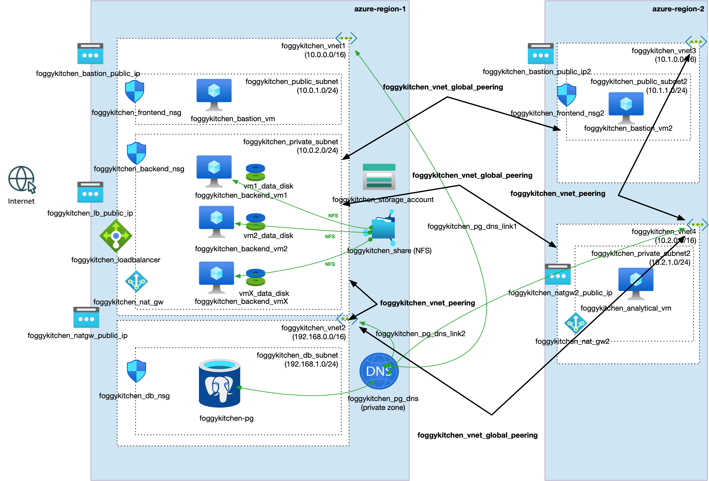

# FoggyKitchen Multicloud Course – Module 08: Advanced Regional Mesh & Transitive Routing

This module demonstrates advanced regional networking topologies in **Oracle Cloud Infrastructure (OCI)** and **Microsoft Azure**, using Terraform or OpenTofu.

We explore how to interconnect multiple VNets/VCNs **across and within regions**, allowing complex routing paths to backend services, databases, and analytics machines.

---

## 🌍 Module Objectives

- Build an **advanced regional mesh** using DRG in OCI and VNet Peering in Azure
- Route traffic between multiple VCNs/VNets both **within and across regions**
- Use **Remote Peering Connections** (OCI) and **Global VNet Peering** (Azure)
- Enable **transitive routing**, with DNS integration where necessary

---

## 📁 Structure

```
module-08-hub-and-spoke/
├── azure/   --> Terraform code for Azure regional mesh (hubless)
└── oci/     --> Terraform code for OCI DRG-based hub with local + remote peering
```

---

## 🌐 Topology Diagrams

### Oracle Cloud Infrastructure (OCI)


### Microsoft Azure


---

## ✅ How to Use

1. Navigate to the desired provider directory: `oci/` or `azure/`
2. Follow instructions in the respective `README.md`
3. Deploy infrastructure with:

```bash
tofu apply
# or
terraform apply
```

---

## 🧠 Learning Goals

- Build **hub-and-spoke** architectures in OCI with **DRG + LPG + RPC**
- Understand **mesh-like architectures** in Azure without DRG
- Enable VMs in one region to access private databases or storage in another
- Apply best practices for **DNS zone linking**, **NAT gateways**, and **security groups**

---

## 🧹 Cleanup

When done, clean up resources:

```bash
tofu destroy
# or
terraform destroy
```

---

## 🔁 Related Modules

- [module-07-cross-region-peering/oci](../module-07-cross-region-peering/oci/)
- [module-07-cross-region-peering/azure](../module-07-cross-region-peering/azure/)
- [module-05-database/oci](../module-05-database/oci/)
- [module-05-database/azure](../module-05-database/azure/)

---

## 🌐 Learn More

Visit [FoggyKitchen.com](https://foggykitchen.com/) for full multicloud diagrams, video labs, and courses.

---

## 🪪 License

Licensed under the Universal Permissive License (UPL), Version 1.0.  
See [LICENSE](../LICENSE) for more details.
