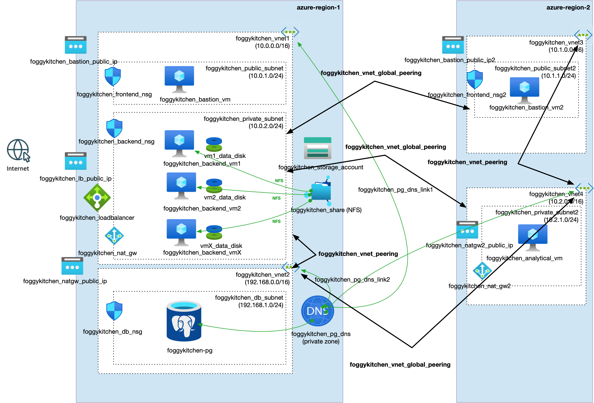

# FoggyKitchen Multicloud Course – Azure Edition – **Module 08: Advanced VNet Peering (Mesh Topology)**



---

## ⚙️ Objective

In this advanced module, we extend the Azure multicloud architecture into a **full VNet mesh topology** across two regions.  
This enables direct, low-latency communication between any virtual network (VNet), supporting cross-region access to PostgreSQL, file shares, and analytical compute.

---

## 🧱 Architecture Components

- **Azure Region 1:**
  - `foggykitchen_vnet1`: Core app components – Bastion, Load Balancer, Backend VMs, NFS file share
  - `foggykitchen_vnet2`: PostgreSQL Flexible Server in a delegated subnet with private DNS zone
- **Azure Region 2:**
  - `foggykitchen_vnet3`: Public Bastion Host for cross-region access
  - `foggykitchen_vnet4`: Analytical VM deployed in a private subnet with NAT gateway access

### Key Design:

- **Full mesh** peering: all VNets are bidirectionally peered
- DNS Private Zone (`foggykitchen_pg_dns`) is linked to both `vnet2` and `vnet4`
- Analytical VM connects securely to PostgreSQL server in another VNet and region
- Bastion Host in `vnet3` enables remote SSH access into the private subnet in `vnet4`

---

## 🛠️ How to Deploy

1. Navigate to this module:

```bash
cd foggykitchen_multicloud/module-08-advanced-routing/azure/
```

2. Initialize Terraform/OpenTofu:

```bash
tofu init
# or
terraform init
```

3. Review the plan:

```bash
tofu plan
# or
terraform plan
```

4. Apply the deployment:

```bash
tofu apply
# or
terraform apply
```

---

## 📁 New Elements Introduced

- `foggykitchen_vnet3` and `vnet4`: New region with cross-VNet peering
- NAT Gateway for `vnet4` private subnet outbound access
- PostgreSQL private DNS zone linked across VNets
- Remote SSH from Bastion VM (`vnet3`) to Analytical VM (`vnet4`)
- Full VNet mesh using `azurerm_virtual_network_peering`

---

## 🧠 Learning Goals

- Configure cross-region, multi-VNet architectures in Azure
- Enable name resolution with private DNS across peered networks
- Use NAT Gateways for outbound access in private subnets
- Practice secure routing across a mesh of VNets without central DRG

---

## 🧹 Cleanup

Destroy the deployed infrastructure:

```bash
tofu destroy
# or
terraform destroy
```

---

## 🔁 Related Modules

- [module-07-cross-region-peering/azure](../module-07-cross-region-peering/azure/) – basic DRG-to-DRG peering
- [module-05-database/azure](../module-05-database/azure/) – PostgreSQL Flexible Server setup
- [module-02-compute/azure](../module-02-compute/azure/) – backend and bastion VM deployment

---

## 🌐 Learn More

Visit [FoggyKitchen.com](https://foggykitchen.com/) for Terraform blueprints, diagrams, and in-depth tutorials.

---

## 🪪 License

Licensed under the Universal Permissive License (UPL), Version 1.0.  
See [LICENSE](../../LICENSE) for more details.
