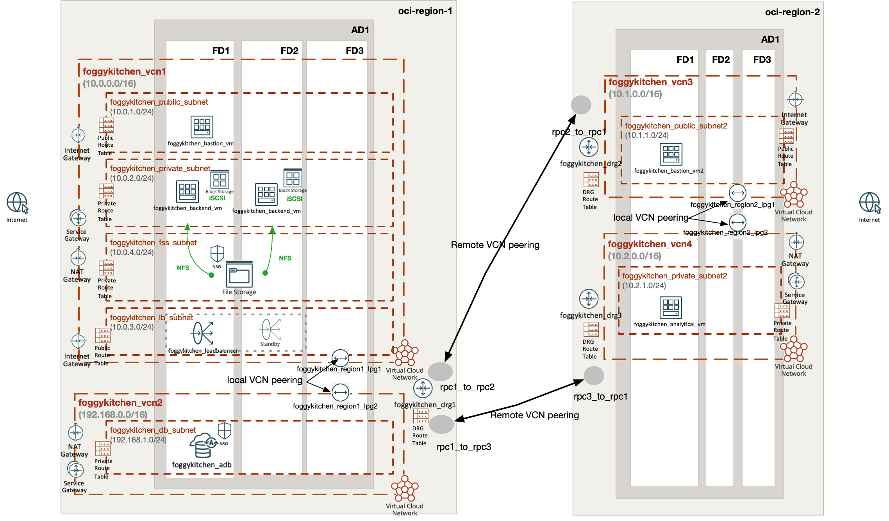

# FoggyKitchen Multicloud Course – OCI Edition – **Module 08: Advanced Routing with Local & Remote Peering**



---

## ⚙️ Objective

In this advanced module, we enhance the multicloud architecture using a mix of **local and remote VCN peering** across multiple **OCI regions**.  
The routing logic prioritizes local LPG-based traffic when possible, while cross-region flows are handled through DRG1 acting as a remote routing hub.

---

## 🧱 Architecture Components

- **Region 1:**
  - `foggykitchen_vcn1`: Core application stack – Bastion, Backend VMs, Load Balancer, NFS
  - `foggykitchen_vcn2`: Autonomous Database (ADB) hosted in isolated subnet
  - `foggykitchen_drg1`: Central DRG with remote peering to Region 2
  - Local peering between `foggykitchen_vcn1` and `foggykitchen_vcn2`
- **Region 2:**
  - `foggykitchen_vcn3`: Public Bastion VM
  - `foggykitchen_vcn4`: Analytical VM in private subnet
  - Local peering between `foggykitchen_vcn3` and `foggykitchen_vcn4`
  - DRG2/DRG3 peered to DRG1 for cross-region routing

### Key Design:
- Local LPG peering is used within each region when possible
- DRG1 acts as a regional and inter-regional hub
- DRG route tables define how traffic is forwarded between regions and VCNs

---

## 🛠️ How to Deploy

1. Navigate to this module:

```bash
cd foggykitchen_multicloud/module-08-advanced-routing/oci/
```

2. Initialize Terraform/OpenTofu:

```bash
tofu init
# or
terraform init
```

3. Plan the changes:

```bash
tofu plan
# or
terraform plan
```

4. Apply the infrastructure:

```bash
tofu apply
# or
terraform apply
```

---

## 📁 New Elements Introduced

- Use of **LPGs** between:
  - `foggykitchen_vcn1` and `foggykitchen_vcn2` (Region 1)
  - `foggykitchen_vcn3` and `foggykitchen_vcn4` (Region 2)
- DRG-based remote routing between regions
- Enhanced DRG route tables with static and dynamic route rules

---

## 🧠 Learning Goals

- Combine **local LPG-based peering** with **remote DRG-based routing**
- Understand transitive and optimized routing with DRGs
- Control traffic flow between regions while minimizing DRG hops
- Align OCI routing behavior with Azure-style mesh + hub

---

## 🧹 Cleanup

When done, remove the infrastructure:

```bash
tofu destroy
# or
terraform destroy
```

---

## 🔁 Related Modules

- [module-07-cross-region-peering/oci](../module-07-cross-region-peering/oci/)
- [module-05-database/oci](../module-05-database/oci/)
- [module-02-compute/oci](../module-02-compute/oci/)

---

## 🌐 Learn More

Visit [FoggyKitchen.com](https://foggykitchen.com/) for more Terraform courses, diagrams, and tutorials.

---

## 🪪 License

Licensed under the Universal Permissive License (UPL), Version 1.0.  
See [LICENSE](../../LICENSE) for more details.
